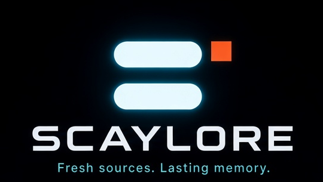

<p align="center">
  
</p>

<p align="center">
  A source goes stale. A memory scrolls away.<br />
  <strong>SCAYLORE</strong> is Scayar’s name for keeping both from happening.
</p>

<p align="center">
  <a href="#the-promise">Promise</a>
  &nbsp;·&nbsp;
  <a href="#the-crew">Crew</a>
  &nbsp;·&nbsp;
  <a href="#the-mark">Mark</a>
  &nbsp;·&nbsp;
  <a href="#this-repository">Repository</a>
</p>

<p align="center">
  
</p>

---

## The promise

Most of what you learn dies in one of two ways. It shows up late, already wrong. Or it shows up true, and then disappears into a thread you will not reopen.

SCAYLORE is the refusal. Keep the source fresh. Keep the memory.

| Keep this | Meaning |
| --- | --- |
| **Fresh sources** | Go get the signal while it is still true. Then check it. New is not the same as right. |
| **Lasting memory** | Put what survived somewhere you can find again — named, stacked, and tied to the next thing. |

The tagline is exact, including the period:

```
Fresh sources. Lasting memory.
```

This repository is the home of that promise: the mark, the five who carry it, and the files you can reuse. It is not an application. There is nothing to install, and that is on purpose.

---

## The crew

Left to right on the hero. The portraits are crops of [`docs/brand/scaylore-heroes.png`](docs/brand/scaylore-heroes.png), not a second drawing.

<table>
<tr>
<td width="20%" align="center" valign="top">
<br /><br />
<strong>Echo</strong><br />
<sub>Communicator</sub>
</td>
<td width="20%" align="center" valign="top">
<br /><br />
<strong>Shelf</strong><br />
<sub>Memory archivist</sub>
</td>
<td width="20%" align="center" valign="top">
<br /><br />
<strong>Lore</strong><br />
<sub>Core guardian</sub>
</td>
<td width="20%" align="center" valign="top">
<br /><br />
<strong>Scout</strong><br />
<sub>Source hunter</sub>
</td>
<td width="20%" align="center" valign="top">
<br /><br />
<strong>Knot</strong><br />
<sub>Linker</sub>
</td>
</tr>
</table>

Same order, one line each:

| Echo | Shelf | Lore | Scout | Knot |
| --- | --- | --- | --- | --- |
| Catch the sentence | Give it a place | Keep it whole | Check the source | Tie it to what it belongs with |

### Echo

Hand already up. Three bubbles, leaving.

Echo lives where knowledge is still a voice: a reply, a ping, a remark that will be gone by tonight. The job is not to talk more. The job is to catch the signal before the room goes quiet, and walk it in while it is still alive.

### Shelf

Both hands on the stack. Careful on purpose.

Shelf does not chase. A lasting memory is not a pile you swear you will sort later. It is layers. Echo brings the signal. Shelf sets it down without dropping what was already kept, so next month it is still a place and not a mood.

### Lore

Eyes closed. Center of the line. The cube holds the mark.

Lore is the quiet one the others are aiming at. Not the hunt, not the chat, not the index. Whatever they touch is supposed to arrive here still itself.

### Scout

Glass up. Leaning in.

Fresh is not true. Scout goes out — pages, feeds, files, claims — and comes back with what survived a look. Without Scout, Echo is only a rumor, and Shelf is a tidy shelf of rumors.

### Knot

A wink. A tile with a chain.

Four specialists are a roster. Knot is why they are a crew. This source belongs with that memory. That memory belongs with the person who will need it next.

```text
Echo  →  Shelf  →  Lore
  ↑                   │
  │                   ↓
Scout ←──────────── Knot
```

Echo brings it in. Shelf gives it a place. Lore keeps it. Knot points at what it belongs with. Scout goes back out, because a memory that never hunts goes stale.

---

## The mark

<p align="center">
  
</p>

Two rounded horizontal bars. A small orange square at the top-right of the upper bar. Cyan glow on a near-black field. That is the whole mark.

It is not a letter S. Do not redraw it into one. The PNG files are crops of the hero. The SVG is the same geometry as vectors, for when a single size has to stay sharp.

| Token | Hex | Where it is |
| --- | --- | --- |
| Void | `#000004` | The canvas behind the crew |
| Night | `#0B1220` | Panels and chrome |
| Signal | `#12D6E8` | Glow, eyes, links |
| Ember | `#F85720` | The orange square |
| Paper | `#F4FFFF` | The bars and the wordmark |

The wordmark is **SCAYLORE**, set wide, in capitals.

| File | Take it when you need |
| --- | --- |
| [`docs/brand/scaylore-heroes.png`](docs/brand/scaylore-heroes.png) | The official crew, full frame |
| [`docs/brand/lockup.png`](docs/brand/lockup.png) | Mark, name, and tagline in one crop |
| [`docs/brand/logo-mark.png`](docs/brand/logo-mark.png) | The mark alone |
| [`docs/brand/logo-mark.svg`](docs/brand/logo-mark.svg) | That same geometry, as vectors |
| [`docs/brand/og.png`](docs/brand/og.png) | A 1280×640 social image |
| [`docs/brand/favicon.ico`](docs/brand/favicon.ico) | A favicon cut from the mark |
| [`docs/brand/crew/`](docs/brand/crew/) | Echo, Shelf, Lore, Scout, Knot |

The file notes live in [`docs/brand/README.md`](docs/brand/README.md). The same faces, as a page: [`docs/index.html`](docs/index.html).

---

## This repository

```text
docs/brand/    Hero, lockup, mark, favicon, social image, crew portraits
docs/          Brand page, and the About text GitHub will not read from a file
scripts/       A stdlib check, and an optional recrop if you have Pillow
LICENSE        MIT
```

The only command this repo asks for:

```bash
git clone https://github.com/Scayar/SCAYLORE.git
cd SCAYLORE
python3 scripts/check-brand.py
```

Python 3. Nothing to install. No network. The script checks that the crops are real, that the crew is named in order, and that the tagline has not drifted.

Recut the lockup, mark, favicon, preview, and portraits after the hero changes:

```bash
python3 -m pip install Pillow
python3 scripts/build_brand_assets.py
```

You will not find a CLI, a package, an API, or a demo server here. When an application exists, this page grows a real install. Until then, do not install `scaylore` from a registry.

---

<p align="center">
  <a href="https://github.com/Scayar">Scayar</a>
  &nbsp;·&nbsp;
  <a href="https://Scayar.com">Scayar.com</a>
  &nbsp;·&nbsp;
  <a href="https://github.com/Scayar/SCAYLORE/issues">Issues</a>
  &nbsp;·&nbsp;
  <a href="LICENSE">MIT</a>
</p>

<p align="center">
  <sub>Fresh sources. Lasting memory.</sub>
</p>
